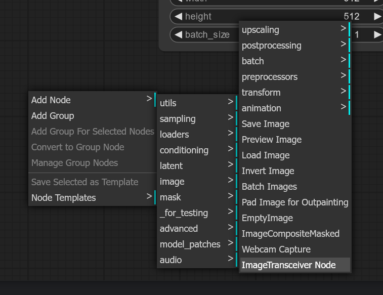
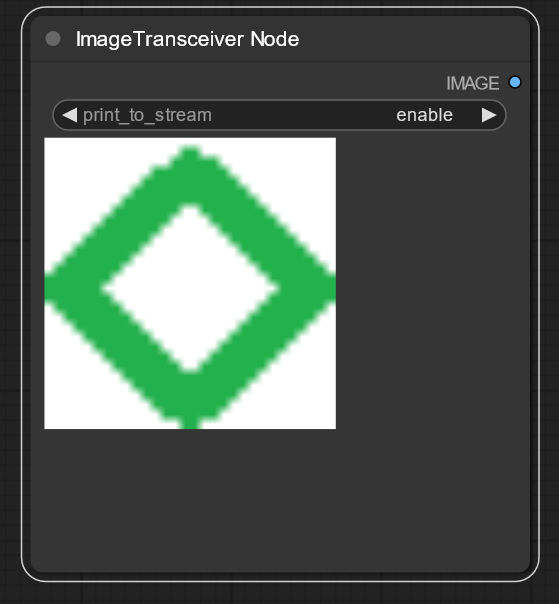
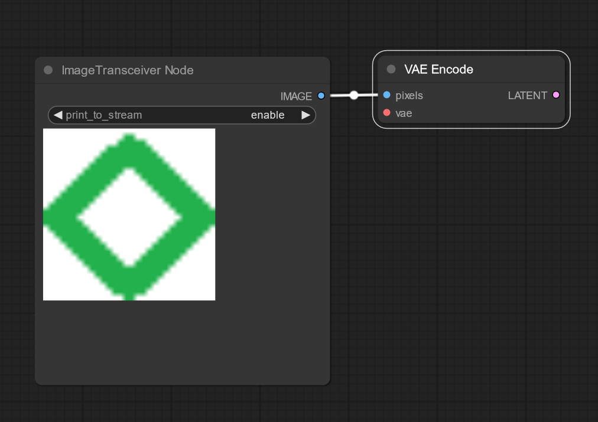
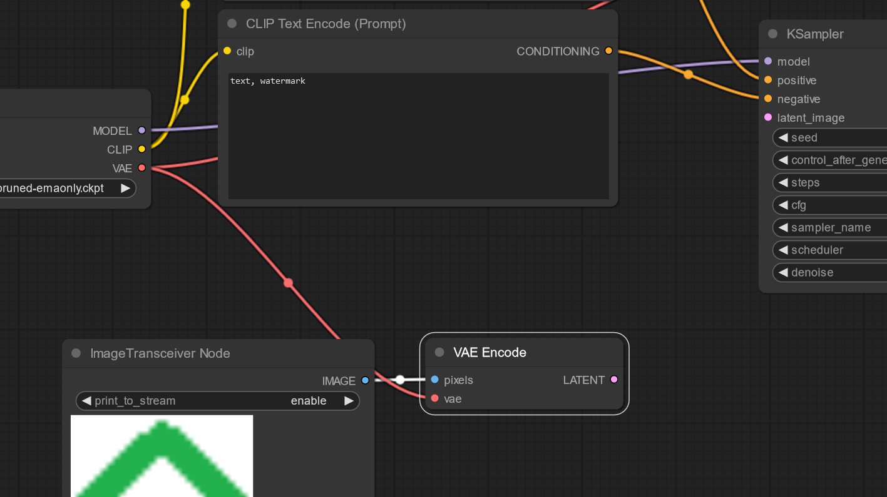
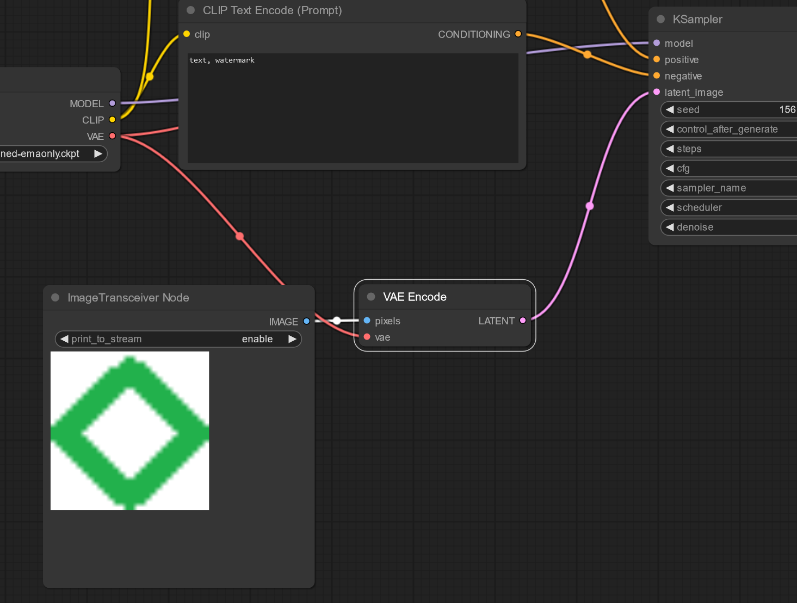
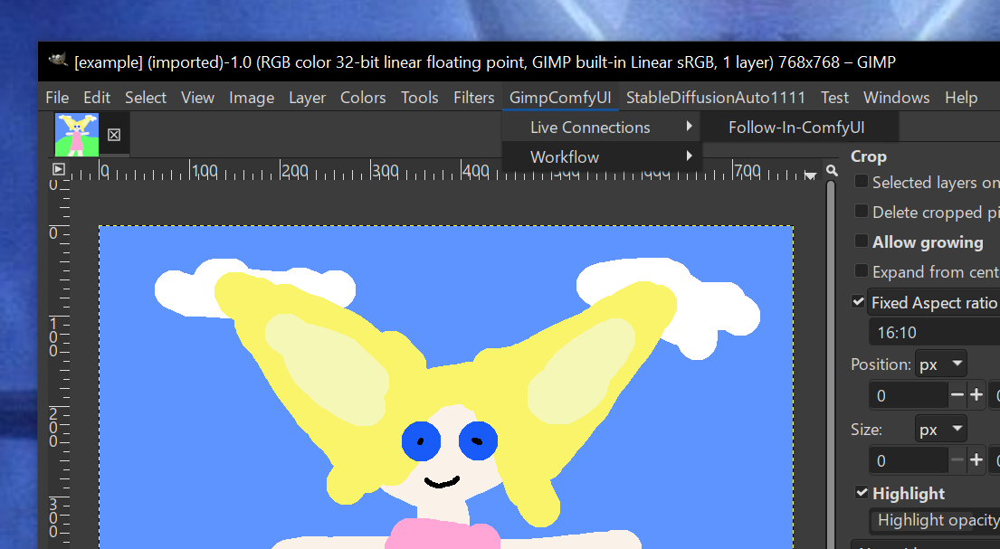
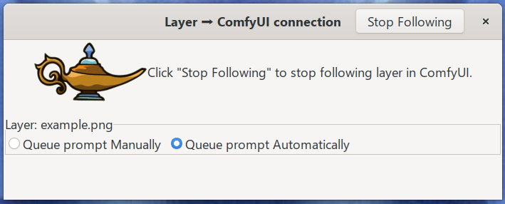

# ImageTransceiver - ComfyUI

ImageTransceiver is a custom node that enables image generating clients to connect directly
 to ComfyUI, and send those images in near real-time. For example, an image manipulation
 program like GIMP can connect an image  to a workflow in ComfyUI, and every time the image
 changes in GIMP, the changes are immediately made in the workflow.


# Cloning
### Important:
This project is a companion project to GimpComfyUI. You should clone that project first, and investigate
its contents. You might not want to clone this project at all. GimpComfyUI requires GIMP 2.99.18+
development release, or GIMP 3.0+
If you wish to review or modify the code of this project, you can clone it into a local directory, and change the
COMFY_NODE_PROJ URL in the gimp_comfy_ui/installer.py script from a GitHub url to a local protocol url. For example, you
can change:

`COMFY_NODE_PROJ: "https://github.com/Charlweed/comfy_image_transceiver_controller`

to

`COMFY_NODE_PROJ: "file://L:/projects/comfyui_custom_nodes/image_transceiver"`

# Building
There is no need to build anything.
# Installation
The GimpComfyUI project includes an installer which will download this project, and copy the appropriate
custom node files from here into the "custom_nodes" directory in ComfyUI. If you are not going to modify code here,
please clone that project first, and use its installer.
If you are going to modify files in this project, you will need to copy the files manually. The important thing to know
is that this project contains additional directories and files that should not be copied into the custom_nodes"
directory. If they are copied, ComfyUI will print error messages. The only directories and files that should be copied
are:
```powershell
js
utilities
__init__.py
image_transceiver.py
```
These should be copied recursively into a folder called "image_transceiver" in the "custom_nodes" directory of ComfyUI.
Generally, you should delete any and all existing contents of "image_transceiver" before you copy. So a powershell
approach to the entire procedure could be:
```powershell
# Assign with the values of this project and the ComfyUI directory
$it_proj_dir = "<this repository>"
$comfyui_dir = "<ComfyUI directory"
$custom_node_dir = Join-Path -Path $comfyui_dir -ChildPath "custom_nodes"
$image_transceiver_dir = Join-Path -Path $custom_node_dir -ChildPath "image_transceiver"
$c_node_sources = "js", "utilities", "__init__.py", "image_transceiver.py"

if(Test-Path -Path $image_transceiver_dir){
    Remove-Item -Recurse -Force $image_transceiver_dir
}
New-Item -ItemType Directory -Path $image_transceiver_dir
foreach($subject in $c_node_sources){
    $source = Join-Path -Path $it_proj_dir -ChildPath $subject
    if(-not (Test-Path -Path $source)){
        throw "Could not find source item `"$source`""
    }
    Copy-Item -Recurse -Force -Path $source -Destination $image_transceiver_dir
}
```

# Usage
After image_transceiver is installed in ComfyUI, and a source such as GIMP 2.99.18+ development release, or GIMP 3.0.x.,
start the ComfyUI server. Check the logs to ensure there are no errors. The log should show that image_transceiver was
loaded. You should see text that looks like:
```commandline
Import times for custom nodes:
   0.0 seconds: L:\projects\3rd_party\ComfyUI\custom_nodes\image_transceiver
```
There might be additional logging that looks like:
```
[image_transceiver.py:153 -       server_control() ] server_control; Operation ServerOperation.START
```
## ComfyUI
Once the server has started, load/create a workflow. Here, we are going to start with the default workflow, and modify
it to shadow the [img2img demonstration of the ComfyUI project](https://comfyanonymous.github.io/ComfyUI_examples/img2img/).
Once you have the Workflow page in your web browser, right-click and navigate the menus to "Add-Node" -> "image" -> "ImageTransceiver"



Resize the node so that the image is entirely with the node's border:


Now, right-click to create a VAE Encoder node. Next, connect the "IMAGE" output on the image_transceiver to the "pixels"
input of the VAE Encoder node.



Continue by connecting the "VAE" output of the Load Checkpoint node to the "vae" input of the VAE Encoder node.


Connect the "LATENT" output of the VAE Encoder node to the "latent_image" input of the KSampler node.



Finally, change the prompt values to match the values in [the demo.](https://comfyanonymous.github.io/ComfyUI_examples/img2img/)
Set the seed to "fixed" so that only changes to your
input image effect the final image:
```
ckpt_name=v1-5-pruned-emaonly.ckpt
positive_prompt=photograph of victorian woman with wings, sky clouds, meadow grass
negative_prompt=watermark, text
seed=280823642470253,
control_after_generate=fixed
sampler_name=dpmpp_2m
denoise=0.87
```

## GIMP
Start GIMP 2.99.18+ development release, or GIMP 3.0.x, and load an image. For best initial results, choose a modestly
sized image. Here, we use the 764x764 sketch from the img2img ComfyUI demo, so you can see how your painting changes
the final results.
You should see the GimpComfyUI menu at the top of the GIMP Window. Insure your main image layer is selected, then
navigate the menus to "GimpComfyUI" ➳ "Live Connections" ➳ "Follow-in-ComfyUI"


A daemon dialog will appear. Select the radio button "Queue prompt Automatically":


Now, you can paint, draw, cut, spray, whatever, into that layer, and the changes will affect what ComfyUI
generates. Sometimes your manipulations will yield exactly what you might expect, often they will not.  All the
prompt-crafting issues are in play, but lower "denoise" strengthens how much the GIMP image comes through to the final
image.

# Contributing

This is very much alpha software. If you see a problem, or opportunities for improvement, please open an issue and make
a pull request. I am also open to adding some contributors to this project, and it's companion.

# Publishing this node.
This note is currently only for the current developer, yours truly, but ...
To publish on comfy.org,
. L:\environments\python311_64bit_comfy_01\Scripts\Activate.ps1
Set-Location <bla-bla>\comfyui_custom_nodes\image_transceiver
<copy API key to clipboard and paste it when prompted. Ignore warnign about workspace.>
comfy node publish

## License

[MIT](https://choosealicense.com/licenses/mit/)
